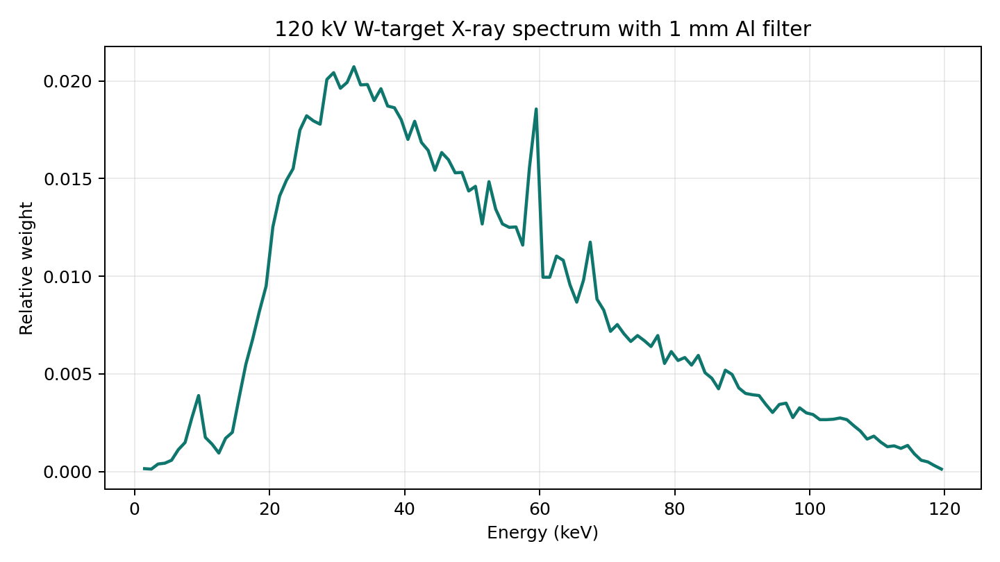
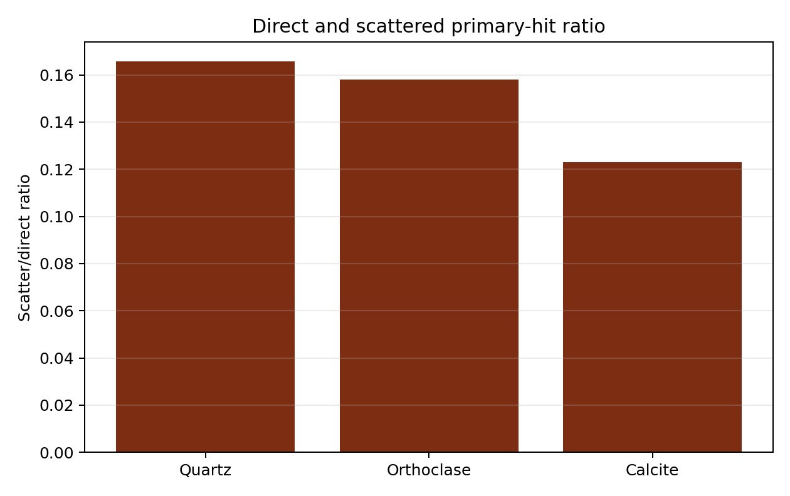
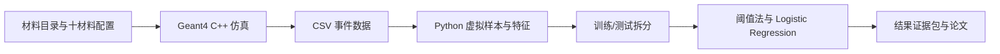

# Geant4 XRT 矿物分选仿真本科项目

这是一个面向本科项目展示和组内学习的 **X 射线透射（XRT）矿物分选仿真系统**。项目用 Geant4 搭建 X 射线源、矿物样本和探测器，用 C++ 输出事件数据，再用 Python 做特征提取、基础分类和图表展示。

> 一句话：这个仓库展示了一条包含仿真建模、事件输出、Python 特征分析、训练/测试验证、结果证据包和论文材料整理的本科项目链路。


## 项目亮点

- **物理仿真链路完整**：从 X 射线源、矿石材料、探测器响应到 CSV 数据输出都有代码实现。
- **材料和能谱有配置文件**：材料表、源项参数和 W 靶 X 射线谱都放在 `source_models/`，不是把数字写死在论文里。
- **结果可追溯**：新增 `results/undergrad_validation/`，包含事件行数、虚拟样本、训练/测试拆分、混淆矩阵和 manifest。
- **分类可解释**：核心依据是透射率、能量沉积和 gamma 命中率等物理相关特征，不是黑箱结果。
- **本科级成果闭环**：有代码、有图、有结果表、有论文稿、有复现说明，适合答辩、组内学习和二次扩展。
- **材料库可扩展**：公开材料目录现在驱动十种材料的本科验证，新增材料需要材料定义、配置文件和重新生成证据包。
- **边界清楚**：最高 `0.9960` accuracy 只表示当前十材料仿真证据包上的粗粒度吸收组测试结果，不等于真实设备效果。

## 先看哪里

第一次阅读建议按这个顺序走：先用 2 分钟扫一遍本页，再读 `docs/TEAM_GUIDE_zh.md`，遇到术语查 `docs/GLOSSARY_BY_FIRST_APPEARANCE.md`，想知道文件位置看 `docs/FILE_MAP_zh.md`，准备上机再看 `docs/RUN_LOCALLY_zh.md`。

如果你暂时不运行代码，可以用 10 分钟完成一次只读理解：先看本页的图文导览，再打开 `results/undergrad_validation/validation_manifest.json` 看材料数、样本数和边界，最后读 `docs/TEAM_GUIDE_zh.md` 中“为什么六材料足够本科验证，但十材料仍不等于产品覆盖”的章节。

| 你是谁 | 推荐入口 |
| --- | --- |
| 完全没接触过项目的组员 | `docs/TEAM_GUIDE_zh.md` |
| 想知道每个文件干什么 | `docs/FILE_MAP_zh.md` |
| 想在自己电脑上跑起来 | `docs/RUN_LOCALLY_zh.md` |
| 看不懂专业词 | `docs/GLOSSARY_BY_FIRST_APPEARANCE.md` |
| 想看论文式成果 | `paper/main_thesis_HIT_revised_zh.md` |
| 想复查准确率来源 | `results/undergrad_validation/validation_manifest.json` |

## 图文导览

### 1. X 射线源不是随便假设的

项目保留了 W 靶 120 kV 能谱数据，用来让源项更接近 XRT 任务的物理背景。



### 2. 仿真输出可以变成可解释特征

探测器记录事件后，Python 统计主 gamma 透射率、探测器能量沉积和 gamma 命中率，用这些特征支撑分类判断。



### 3. 基础分类已有可复查证据

当前证据包包含十种材料，每种材料 5000 个 events，每 100 个 events 聚合为 1 个虚拟样本，共 500 个虚拟样本。每种材料前 25 个样本训练、后 25 个样本测试，总测试样本为 250 个。当前三特征 Logistic Regression 在测试集上正确 249 个样本，accuracy 为 `0.9960`。


## 项目流程



## 快速运行

如果你的电脑已经安装好 Geant4、CMake、C++ 编译器和 Python 依赖，可以从仓库根目录运行材料目录启用的十材料公开复现配置：

```bash
pip install pandas scikit-learn
cmake -S . -B build
cmake --build build
cd build

for material in quartz calcite orthoclase albite dolomite pyrite hematite magnetite chalcopyrite galena; do
  XRT_EXPERIMENT_CONFIG=../source_models/config/undergrad_batch/${material}.txt \
    ./xrt_sorter ../analysis/configs/run_research.mac
done

cd ..
python analysis/classify_absorption_groups.py
```

如果运行时提示找不到 Geant4 动态库，请先加载本机 Geant4 环境脚本，例如 `source /path/to/geant4-install/bin/geant4.sh`。更详细的依赖和排错见 `docs/RUN_LOCALLY_zh.md`。

运行成功后，最少检查三件事：`event_row_summary.csv` 中十种材料都是 5000 events，`validation_manifest.json` 中训练/测试样本分别为 250/250，`absorption_group_classification_summary.csv` 中三特征 Logistic Regression 为 `249/250 = 0.9960`。复跑有随机性，数字可以小幅波动。

## 目录结构

```text
include/              Geant4 C++ 头文件
src/                  Geant4 C++ 实现
source_models/        材料、源项、能谱和实验配置
analysis/             Python 分类脚本和运行宏
results/              本科级结果表和验证证据包
figures/              README 和论文可引用的图
docs/                 给组员看的讲解文档
paper/                本科论文式材料
```

## 项目边界

本仓库公开的是本科级仿真项目成果。它可以说明：我们完成了 Geant4 XRT 仿真系统、数据输出、基础特征分析、明确训练/测试拆分和仿真数据上的粗粒度分类验证。

最初六材料已经足够证明本科项目的基本闭环；当前十材料证据包进一步说明材料库和配置流程可以扩展。但它不应该被解释为：已经完成现场设备验证、可直接用于分选设备控制、已经覆盖复杂矿石流的全部情况、或可以对世界上所有矿物都保持同样准确率。

## 权利声明

本仓库用于项目组学习、运行、答辩展示和组内协作。代码、文档、图表和项目构思均保留权利。未经项目负责人和指导教师许可，不得复制为个人项目、转发为独立成果、商用、二次发布或冒名使用。详见 `LICENSE.md` 和 `NOTICE.md`。
