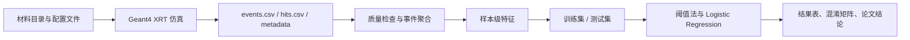

# 组员从零入门指南

这份文档写给完全没有参与过项目的组员。读完以后，你应该能回答四个问题：这个项目为什么要做，数据从哪里来，Python 怎么把数据变成机器学习样本，最后的 accuracy 代表什么、又不代表什么。它不是术语表，也不是论文压缩版，而是一份能帮你接手、复述和复现项目的说明书。

## 0. 先按用途找文件

| 你现在想做什么 | 先看哪些文件 | 它解决什么问题 |
| --- | --- | --- |
| 快速知道项目是什么 | `README.md`、本文件 | 项目目标、数据链路、结果边界 |
| 看论文式表达 | `paper/main_thesis_HIT_revised_zh.md` | 导师审阅和答辩表述 |
| 在自己电脑运行 | `docs/RUN_LOCALLY_zh.md` | Geant4、CMake、Python 复现步骤 |
| 查每个文件干什么 | `docs/FILE_MAP_zh.md` | 仓库结构和证据链位置 |
| 看不懂术语 | `docs/GLOSSARY_BY_FIRST_APPEARANCE.md` | 常用技术词的大白话解释 |
| 理解分类脚本 | `analysis/classify_absorption_groups.py` | 特征、拆分、模型和输出 |
| 核对结果来源 | `results/undergrad_validation/` | CSV、混淆矩阵和 manifest |

第一次读仓库时，不要从 `src/` 一头扎进去。更高效的顺序是：先读 `README.md` 和本文档，知道项目链路；再看 `results/undergrad_validation/validation_manifest.json`，确认数据规模和边界；最后回到 C++ 和 Python 代码，看每段代码服务于哪一段证据。

## 1. 一句话理解项目

这个项目是在电脑里搭建一个简化的 X 射线透射实验：让模拟 X 射线穿过不同矿物材料，记录探测器接收到多少信号，再用 Python 把这些信号整理成特征，并验证它们能否区分“低吸收组”和“高吸收组”。

更短地说，它不是直接拿真实设备数据训练产品模型，而是先用 Geant4 完成物理仿真，再用 Python 完成本科级别的特征分析和基础分类验证。

## 2. 项目真正完成了什么

当前公开仓库完成的是一个本科级研究闭环。第一，它有可运行的 Geant4 C++ 程序，可以配置 X 射线源、矿物样本、探测器和输出文件。第二，它有材料目录和批量配置，可以运行十种公开验证材料。第三，它有 Python 分析脚本，可以把事件数据聚合成虚拟样本，提取物理相关特征，并进行训练/测试拆分。第四，它有结果证据包、图表、复现说明和论文式文本，方便导师、队友和未来的自己复查。

你理解项目时，重点不要放在“材料数量”这个单点上，而要放在完整链路上：配置文件决定仿真条件，Geant4 产生事件数据，Python 做质量检查和特征工程，机器学习模型只在测试集上评估，文档再把这些证据组织成可讲清楚的结论。

## 3. 输入数据从哪里来

公开复现实验使用 `source_models/config/undergrad_batch/` 下的配置文件。每个配置文件指定一种单一材料、10 mm 样本厚度、W 靶 120 kV 能谱、探测器位置和输出前缀。真正控制每种材料事件数的是 `analysis/configs/run_research.mac` 中的 `/run/beamOn 5000`，意思是每种材料运行 5000 个仿真事件。

材料总表是 `source_models/materials/material_catalog.csv`。它把材料名、化学式、密度、类别、吸收组标签、配置文件和事件文件连在一起。Python 脚本不是手写十个文件名，而是读取这个材料目录，找出启用的材料，再逐个读取对应事件文件。因此，如果以后新增材料，不能只改论文或 README，还要补 Geant4 材料定义、配置文件、材料目录和新的证据包。

当前公开验证材料包括低吸收组的 Quartz、Calcite、Orthoclase、Albite、Dolomite，以及高吸收组的 Pyrite、Hematite、Magnetite、Chalcopyrite、Galena。这里的低/高吸收标签是为了做粗粒度吸收组验证，不是矿物种类级识别。

## 4. Geant4 输出了哪些数据

Geant4 运行后主要输出三类文件。第一类是 `*_events.csv`，每一行对应一次仿真事件，也是当前机器学习验证的主要输入。第二类是 `*_hits.csv`，记录更细的命中位置、能量、primary 标记和偏转角等信息，主要用于理解探测器响应。第三类是 metadata 文件，用来记录 run 的基本配置和统计信息。

当前分类脚本主要读取事件级 CSV。核心字段如下：

| CSV 字段 | 大白话含义 | 后续用途 |
| --- | --- | --- |
| `event_id` | 第几次模拟事件 | 排序、检查连续性、构造样本编号 |
| `detector_edep_keV` | 探测器里沉积了多少能量 | 计算平均能量沉积特征 |
| `detector_gamma_entries` | gamma 进入探测器的次数 | 计算 gamma 命中率 |
| `primary_gamma_entries` | 原始 gamma 到达探测器的次数 | 计算主 gamma 透射率 |

你可以把一次 event 理解为一次模拟发射和探测。单次 event 波动比较大，所以机器学习不会直接用单行 event 做样本，而是先聚合。

## 5. 数据清洗和质量控制做了什么

Python 脚本的第一步不是训练模型，而是检查数据是否能用。它会确认材料目录里启用的材料不为空，确认每个材料指向的配置文件存在，确认每个事件文件存在。读取事件 CSV 后，脚本按 `event_id` 排序，统计事件行数、唯一事件数、重复事件数、最小和最大事件编号，并判断事件编号是否连续。

每种材料当前都有 5000 行事件数据，`event_id` 从 0 到 4999，没有重复事件编号。脚本设置 `PHOTONS_PER_SAMPLE = 100`，因此 5000 个事件刚好形成 50 个完整虚拟样本。如果以后事件数不是 100 的整数倍，脚本会丢弃尾部不完整事件，并把丢弃数量写入 `event_row_summary.csv`。这一步就是最基本的数据清洗：只让完整、可比较的样本进入后续分析。

质量检查结果写在 `results/undergrad_validation/event_row_summary.csv`，虚拟样本写在 `absorption_group_virtual_samples.csv`，训练/测试拆分写在 `train_test_split_samples.csv`。这些文件比最终 accuracy 更重要，因为它们说明 accuracy 是从什么数据规模和什么拆分规则来的。

## 6. event 怎样变成机器学习样本

机器学习里的“样本”不是单个 photon event，而是每 100 个 event 聚合成的虚拟样本。这个规则写在 `analysis/classify_absorption_groups.py` 的 `PHOTONS_PER_SAMPLE = 100`。

| 层级 | 数量 |
| --- | ---: |
| 每种材料 event 数 | 5000 |
| 每个虚拟样本包含 event 数 | 100 |
| 每种材料虚拟样本数 | 50 |
| 十种材料总虚拟样本数 | 500 |
| 训练集样本数 | 250 |
| 测试集样本数 | 250 |

这样处理的好处是让样本更稳定。单次 event 可能因为随机过程出现波动，但 100 次 event 的平均能量、命中次数和透射率更适合做分类验证。

## 7. Python 构造了哪些特征

Python 脚本从事件级字段构造出样本级特征。你读 `analysis/classify_absorption_groups.py` 时，可以按下面的对应关系理解变量：

| Python 变量 | 计算方式 | 大白话含义 |
| --- | --- | --- |
| `sample_id` | `event_id // 100` | 每 100 个 event 编成一个样本编号 |
| `n_events` | 每个样本内 event 数 | 这个样本包含多少次模拟 |
| `detector_edep_keV_sum` | `detector_edep_keV` 求和 | 100 次 event 总共沉积了多少能量 |
| `mean_detector_edep_keV` | 能量沉积总和 / `n_events` | 平均每次 event 的探测器能量沉积 |
| `detector_gamma_rate` | gamma 命中总数 / `n_events` | 探测器 gamma 命中率 |
| `primary_transmission_rate` | primary gamma 命中总数 / `n_events` | 主 gamma 透射率，也是最核心的吸收差异特征 |
| `group_label` | 材料目录映射 | 低吸收组或高吸收组 |

这不是一堆黑箱变量。三个核心特征都能回到物理直觉：材料越容易吸收 X 射线，穿过样本并到达探测器的 primary gamma 通常越少，透射率也越低；探测器能量沉积和 gamma 命中率也会随材料吸收特性变化。

## 8. 训练集和测试集怎样划分

当前脚本确实做了训练/测试拆分，而不是在训练集上报准确率。拆分规则是按每种材料分别切分：前 25 个虚拟样本进入训练集，后 25 个虚拟样本进入测试集。十种材料合计后，训练集为 250 个虚拟样本，测试集也是 250 个虚拟样本。

这能避免最基本的数据泄漏，即不能用同一批样本既训练又评价。但也要讲清楚它的局限：训练集和测试集来自同一套仿真配置、同一种几何、同一类材料设定，所以它是同分布仿真切分测试，不等于真实设备测试，也不证明模型能自动推广到所有矿物。

## 9. 机器学习方法到底是什么

脚本做了三种基础方法对比。

第一种是阈值法 `A_threshold_transmission_only`。它只看 `primary_transmission_rate`。脚本先在训练集里分别计算低吸收组和高吸收组的平均透射率，再取两个均值的中点作为 threshold。测试样本透射率高于 threshold 就判为低吸收组，低于 threshold 就判为高吸收组。

第二种是单特征 Logistic Regression `B_logistic_transmission_only`。它仍然只使用 `primary_transmission_rate`，但用 scikit-learn 的 `StandardScaler + LogisticRegression` 建立线性分类边界。`StandardScaler` 的作用是把特征标准化，`LogisticRegression` 的作用是学习从特征到类别的线性判别关系。

第三种是三特征 Logistic Regression `C_logistic_transmission_edep_gamma`。它使用 `primary_transmission_rate`、`mean_detector_edep_keV` 和 `detector_gamma_rate` 三个特征。这个方法看起来更像一个小型特征组合模型，但仍然是基础、可解释的本科级方法，不是决策树、随机森林或深度学习。

如果导师问“你们用了什么模型”，准确回答是：我们用了一个阈值 baseline 和两个基于 `StandardScaler + LogisticRegression` 的线性分类模型，一个只用主 gamma 透射率，另一个使用主 gamma 透射率、平均探测器能量沉积和 gamma 命中率三个特征。

## 10. accuracy 是怎样得出的

当前证据包里，所有 accuracy 都只在测试集上计算，测试集分母是 250 个虚拟样本。

| 方法 | 测试样本 | 正确样本 | 测试 accuracy |
| --- | ---: | ---: | ---: |
| 阈值法 | 250 | 246 | 0.9840 |
| 单特征 Logistic Regression | 250 | 248 | 0.9920 |
| 三特征 Logistic Regression | 250 | 249 | 0.9960 |

以三特征 Logistic Regression 为例，`results/undergrad_validation/absorption_group_confusion_logistic_3f.csv` 显示：低吸收组 125 个测试样本中 124 个判对、1 个被判成高吸收组；高吸收组 125 个测试样本全部判对。所以 `0.9960` 的意思是 `249 / 250`，不是“世界上所有矿物都能 99.60% 分对”。

## 11. 为什么不能说产品覆盖所有矿物

当前项目目标是完成一个本科级仿真与分析闭环，而不是证明工业产品已经可用。我们验证的是十种单一材料、固定 10 mm 厚度、固定仿真几何、同分布训练/测试拆分下的低/高吸收组二分类。这个范围已经足以说明链路跑通：仿真能产出数据，数据能形成特征，特征能支持基础分类，结果能被 CSV 和图表复查。

但真实矿石可能包含混合矿物、包裹体、裂隙、孔隙、粒径变化、表面污染、含水率变化、设备噪声、传送带速度变化和探测器漂移。真实产品还要考虑误分成本、执行机构、实时性、操作员复核和维护流程。因此，当前结果只能说支持本科级仿真验证，不能说已经覆盖所有矿物、达到工业部署或替代真实设备验证。

如果导师后续要求更高标准，下一步不是在文档里硬说已经完成，而是重新设计实验：增加材料、增加厚度和几何变化、加入混合材料、固定随机种子并做多次重复、按独立 run 拆分测试，最终接入真实设备或真实样品数据。

## 12. 导师问你时怎么回答

如果导师问“这个项目到底做了什么”，可以回答：我们完成了一个基于 Geant4 的 XRT 矿物分选仿真和 Python 分析闭环，能够从配置文件生成仿真事件数据，再把事件数据转成样本级特征，并用基础可解释模型验证低/高吸收组分类。

如果导师问“数据从哪里来”，可以回答：数据不是手写的，也不是真实设备采集的，而是 Geant4 按材料配置、X 射线能谱和探测器几何生成的事件级 CSV；Python 再做质量检查、每 100 个事件聚合为一个虚拟样本，并输出训练/测试拆分和结果表。

如果导师问“为什么不用更复杂模型”，可以回答：当前本科阶段重点是证明物理仿真和数据链路成立，所以优先采用阈值法和 Logistic Regression 这类可解释模型。复杂模型可以作为后续扩展，但在当前数据规模和证据边界下，先讲清楚特征和验证逻辑更重要。

如果导师问“为什么不能说产品化”，可以回答：因为当前数据是固定条件下的仿真数据，样本是单一材料 slab，没有真实设备、混合矿流和跨工况验证。我们已经完成本科级闭环；产品化需要下一阶段证据。

## 13. 材料级分选诊断为什么重要

我们额外补了一条材料级诊断线，用来回答“能不能直接识别十种材料名”。结论是：当前旧数据不够。脚本 `analysis/material_sorting.py` 会尝试预测 Quartz、Calcite、Pyrite、Galena 等十个材料标签，并输出 top-1、top-3、置信度、margin、复核原因和开放集检查。当前主方法 `Calibrated Extra Trees` 的 top-1 accuracy 只有 `0.464`，top-3 accuracy 为 `0.876`，macro-F1 为 `0.4486`，review rate 为 `0.848`，所有材料级验收条件都没有通过。

这个结果对项目是有价值的，因为它防止我们把 `0.9960` 二分类结果错误说成十材料识别结果。最准确的表述是：当前公开包已经证明低/高吸收组二分类闭环成立；材料级分选还处于诊断和下一阶段实验设计阶段。

## 14. 后续如果要继续做

后续有两条路线。科研严谨性路线是补强证据：固定随机种子、多种子重复、不同厚度、不同几何、混合材料、按独立 run 拆分测试和真实设备对照。产品原型路线是把模型从“直接输出材料标签”改成“输出可解释物理/化学描述符，再结合矿物字典做候选检索和人工复核”。这两条路线都可以做，但都不是当前本科公开包已经完成的能力。

## 15. 一句话复述

这个仓库展示的是一个本科级 Geant4 XRT 仿真项目：它用十种材料的仿真事件数据构造 500 个虚拟样本，在明确训练/测试拆分下完成低吸收组/高吸收组基础分类验证，并把代码、证据、图表、论文说明和复现路径整理成可学习、可运行、可复查的公开包。
