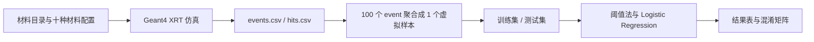

# 组员从零入门指南

这份文档写给完全没有参与过项目的组员。它的目标不是让你背术语，而是让你能看懂这个 GitHub 仓库里真实做了什么、数据怎么来、准确率怎么得出、哪些结论能说、哪些结论不能说。

## 0. 先按用途找文件

| 你现在想做什么 | 先看哪些文件 | 它解决什么问题 |
| --- | --- | --- |
| 快速知道项目是什么 | `README.md`、本文件 | 项目目标、成果亮点、读法顺序 |
| 看懂讲解内容 | `docs/TEAM_GUIDE_zh.md`、`docs/GLOSSARY_BY_FIRST_APPEARANCE.md`、`docs/FILE_MAP_zh.md` | 背景、术语、文件位置 |
| 在自己电脑运行 | `docs/RUN_LOCALLY_zh.md`、`analysis/configs/run_research.mac`、`source_models/config/undergrad_batch/*.txt` | Geant4/CMake/Python 运行步骤 |
| 理解数据从哪里来 | `src/RunAction.cc`、`src/EventAction.cc`、`src/SteppingAction.cc` | C++ 如何写出 CSV 字段 |
| 理解分类怎么做 | `analysis/classify_absorption_groups.py`、`results/undergrad_validation/` | 样本构造、训练/测试拆分、分类器、混淆矩阵 |
| 写论文或答辩 | `paper/main_thesis_HIT_revised_zh.md`、`paper/reproducibility.md`、`figures/` | 正式表述、复现路径、图表引用 |
| 继续开发代码 | `include/`、`src/`、`source_models/`、`analysis/` | Geant4 主程序、配置、Python 分析 |

不要从 `src/` 一头扎进去。先读本文件，再看 `results/undergrad_validation/validation_manifest.json`，最后回到代码。这样你知道每段代码是在服务哪一段证据链。

## 1. 用一句通俗话理解项目

这个项目做的是：在电脑里搭一个虚拟 X 射线透射实验，让 X 射线穿过不同矿物材料，记录探测器接收到多少信号，再用 Python 把这些信号整理成特征，判断样本属于“低吸收组”还是“高吸收组”。

更短地说，它不是直接拿真实机器数据训练模型，而是先用 Geant4 做物理仿真，再用 Python 做本科级别的特征分析和基础分类验证。

## 2. 项目真正完成了哪些内容

这个公开仓库展示的是本科级别成果闭环。第一，仓库里有 Geant4 C++ 程序，可以配置 X 射线源、矿物样本、探测器和输出文件。第二，仓库里有十种公开复现材料配置：Quartz、Calcite、Orthoclase、Albite、Dolomite、Pyrite、Hematite、Magnetite、Chalcopyrite、Galena。第三，仓库里有 Python 脚本，把仿真事件数据聚合为虚拟样本，并进行粗粒度吸收组分类。第四，仓库里有结果证据包、图表、论文式说明和本地运行说明。

这里最重要的不是某一个数字，而是“从物理仿真到数据表、从数据表到特征、从特征到分类结果”的链条已经打通。你看项目时要沿着这条链路看，不要只看最后的 accuracy。

## 3. 数据是怎么产生的

公开复现实验使用 `source_models/config/undergrad_batch/` 中的十个配置文件。每个配置文件指定一种单一材料、10 mm 样本厚度、W 靶 120 kV 能谱、探测器位置和输出前缀。`analysis/configs/run_research.mac` 中的核心命令是 `/run/beamOn 5000`，意思是每种材料发射 5000 次模拟事件。

配置文件里最重要的字段如下：

| 配置字段 | 当前公开设定 | 为什么重要 |
| --- | --- | --- |
| `output_prefix` | `xrt_real_source_<material>` | 决定输出 CSV 文件名，Python 脚本按材料目录里的 `event_file` 去读取。 |
| `source_mode` | `spectrum` | 表示使用能谱源，而不是单能 gamma。 |
| `spectrum_file` | `w_target_120kV_1mmAl.csv` | 指向 W 靶 120 kV 能谱，是源项的物理锚点。 |
| `ore_material_mode` | `single` | 当前本科证据包使用单一材料 slab，不是混合矿石。 |
| `ore_primary_material` | 每个配置不同 | 决定这次仿真的矿物材料。 |
| `ore_thickness_mm` | `10.0` | 样本厚度会直接影响 X 射线衰减。 |
| `detector_x_cm` | `25.0` | 决定探测器放在样本后方的位置。 |

`source_models/materials/material_catalog.csv` 是当前 Python 分类脚本读取的材料索引。它把材料名、化学式、密度、分组标签、配置文件和事件文件连在一起，因此新增材料时不能只改文档，还要让目录、配置、C++ 材料定义和新证据包一致。

C++ 端写出的主要事件文件叫 `xrt_real_source_<material>_events.csv`。这个文件不是手写表格，而是 Geant4 程序运行后由 `src/RunAction.cc`、`src/EventAction.cc` 和 `src/SteppingAction.cc` 写出的。事件表每一行对应一次模拟事件，表头如下：

| CSV 字段 | 来自哪里 | 含义 |
| --- | --- | --- |
| `event_id` | `EventAction` | 第几次模拟事件，从 0 到 4999 |
| `detector_edep_keV` | `SteppingAction` 累加后写出 | 探测器中沉积的能量，单位 keV |
| `detector_gamma_entries` | gamma 进入探测器时计数 | 探测器接收到的 gamma 命中数 |
| `primary_gamma_entries` | primary gamma 到达探测器时计数 | 没有被作为次级粒子重新产生的主 gamma 命中数 |

还有一个 `*_hits.csv` 文件，记录更细的命中位置、能量、是否为 primary、偏转角等信息。本科公开分类主要使用 `*_events.csv`，因为它更适合做稳定、清楚的样本级统计。

## 4. event 怎样变成分类样本

机器学习里说的“样本”不是单个 photon event。我们把每 100 个仿真事件聚合成一个虚拟样本。这个规则写在 `analysis/classify_absorption_groups.py` 的 `PHOTONS_PER_SAMPLE = 100`。

因此，数据规模是这样来的：

| 层级 | 数量 |
| --- | --- |
| 每种材料 event 数 | 5000 |
| 每个虚拟样本包含 event 数 | 100 |
| 每种材料虚拟样本数 | 50 |
| 十种材料总虚拟样本数 | 500 |
| 低吸收组样本数 | 250 |
| 高吸收组样本数 | 250 |

脚本会生成 `results/undergrad_validation/absorption_group_virtual_samples.csv`，这里每一行才是分类使用的虚拟样本。

## 5. Python 里用了哪些变量

Python 脚本从事件级字段构造出样本级特征。你读 `analysis/classify_absorption_groups.py` 时，可以按下面的对应关系理解变量：

| Python 变量 | 计算方式 | 大白话含义 |
| --- | --- | --- |
| `sample_id` | `event_id // 100` | 每 100 个 event 编成一个样本编号 |
| `n_events` | 每个 `sample_id` 的 event 数 | 这个虚拟样本里有多少次发射 |
| `detector_edep_keV_sum` | `detector_edep_keV` 求和 | 100 次事件总共在探测器留下多少能量 |
| `primary_gamma_entries_sum` | `primary_gamma_entries` 求和 | 100 次事件中有多少主 gamma 到达探测器 |
| `mean_detector_edep_keV` | `detector_edep_keV_sum / n_events` | 平均每次事件的探测器能量沉积 |
| `detector_gamma_rate` | `detector_gamma_entries_sum / n_events` | 探测器 gamma 命中率 |
| `primary_transmission_rate` | `primary_gamma_entries_sum / n_events` | 主 gamma 透射率，是最核心的吸收差异特征 |
| `group_label` | `GROUP_MAP` 映射 | 分类标签：低吸收组或高吸收组 |

本项目不是用一堆黑箱变量硬训练。三个核心特征都能回到物理直觉：材料越容易吸收 X 射线，透过样本到达探测器的 primary gamma 通常越少，透射率也就越低。

## 6. 训练集和测试集怎样划分

你提出的这个问题很关键：不能用训练集训练后又在训练集上报准确率。当前脚本确实做了训练/测试拆分。

拆分规则是按每种材料分别切分：前 25 个虚拟样本进入训练集，后 25 个虚拟样本进入测试集。十种材料合计后，训练集为 250 个虚拟样本，测试集也为 250 个虚拟样本。结果证据见 `results/undergrad_validation/train_test_split_samples.csv` 和 `results/undergrad_validation/validation_manifest.json`。

这说明当前结果不是“训练集准确率”。但也要讲清楚它的局限：训练集和测试集来自同一套仿真配置、同一种几何、同一类材料设置。这叫同分布仿真切分测试，不能等同于真实设备测试，也不能证明模型能自动推广到世界上所有矿物。

## 7. 分类方法到底是什么

脚本做了三种基础方法对比。

第一种是阈值法 `A_threshold_transmission_only`。它只看 `primary_transmission_rate`。脚本先在训练集里分别计算低吸收组和高吸收组的平均透射率，再取两个均值的中点作为 `threshold`。测试样本的透射率高于阈值就判为低吸收组，低于阈值就判为高吸收组。

第二种是单特征 Logistic Regression：`B_logistic_transmission_only`。它仍然只用 `primary_transmission_rate`，但用 scikit-learn 的 `StandardScaler + LogisticRegression` 建立一个线性分类边界。`StandardScaler` 的作用是把特征标准化，`LogisticRegression` 的作用是学习从特征到类别概率的线性判别关系。

第三种是三特征 Logistic Regression：`C_logistic_transmission_edep_gamma`。它使用 `primary_transmission_rate`、`mean_detector_edep_keV` 和 `detector_gamma_rate` 三个特征。这个方法看起来更像一个小型特征组合模型，但仍然是基础、可解释的本科级方法，不是复杂深度学习。

## 8. 准确率是怎么得出来的

本轮提交的证据包中，三种方法都只在测试集上计算 accuracy。测试集分母是 250 个虚拟样本。

| 方法 | 测试样本 | 正确样本 | 测试 accuracy |
| --- | ---: | ---: | ---: |
| 阈值法 | 250 | 246 | 0.9840 |
| 单特征 Logistic Regression | 250 | 248 | 0.9920 |
| 三特征 Logistic Regression | 250 | 249 | 0.9960 |

混淆矩阵可以告诉我们错在哪里。以三特征 Logistic Regression 为例，`results/undergrad_validation/absorption_group_confusion_logistic_3f.csv` 的含义是：行是真实标签，列是预测标签。当前证据集中，高吸收组 125 个测试样本全部判对；低吸收组 125 个测试样本中有 1 个被判成高吸收组。

所以，`0.9960` 的意思是 `249 / 250`，不是“世界上所有矿物都能 99.60% 分对”。它只属于这次十材料、单一材料、固定厚度、仿真数据、粗粒度二分类任务。

## 9. 为什么六材料足够本科验证，但十材料仍不等于产品覆盖

最初六材料已经足够支撑本科验证，是因为本科主线要证明的是“仿真-数据-特征-分类-证据包”的链路是否跑通，而不是证明产品覆盖所有矿物。六材料里有 3 个低吸收材料和 3 个高吸收材料，已经能验证粗粒度吸收组任务不是单个材料对单个材料的玩具例子。

当前十材料证据包进一步强化了展示效果：它把 C++ 中已经支持但之前没有进入公开证据的 Albite、Dolomite、Chalcopyrite、Galena 纳入材料目录和复现实验，说明系统不是只能跑六个固定名字。但真实矿石可能有混合矿物、裂隙、孔隙、粒径变化、表面污染、设备噪声、传送带速度、探测器响应漂移等问题。即使只在计算机里，也不能因为十种材料分得好，就推出“世界上所有矿物都能正确分类”。

更严谨的说法是：当前结果表明，在公开仓库定义的十种材料仿真配置中，XRT 事件数据能够形成有区分度的透射特征，并支持低吸收组/高吸收组的粗粒度分类验证。这个结论有证据支持，也没有越界。

## 10. 如何新增一种材料

新增材料的标准流程是：先确认 `src/DetectorConstruction.cc` 里有这个材料的 Geant4 定义；再在 `source_models/config/undergrad_batch/` 新建配置；然后在 `source_models/materials/material_catalog.csv` 里补材料行；接着运行 Geant4 生成该材料的 `*_events.csv`；最后重新运行 `analysis/classify_absorption_groups.py` 生成新的证据包。

这就是当前仓库的“可扩展性”：它不是承诺任意矿物只改词典就能识别，而是把新增材料需要走的工程路径固定下来。未来更高级的产品化方向可以探索“物理/化学特征输出 + 矿物字典候选检索”，但这属于后续研究，不是当前本科公开包已经完成的能力。

## 11. 直接命中和散射命中怎样理解

`src/SteppingAction.cc` 里还记录了 `is_direct_primary` 和 `is_scattered_primary`。当前工程判据是：primary gamma 到达探测器时，如果相对束流方向的偏转角 `theta_deg < 1.0`，就记为近似直接透射；否则记为散射后透射。

这只是本科项目中的工程近似，不是严格的物理真值分类。写论文或答辩时，可以说“使用 1 度阈值作为工程判据区分近似直接透射和散射后透射”，不要说成“精确识别了所有散射物理过程”。

## 12. 最推荐的阅读顺序

第一次读仓库时，按这个顺序效率最高：

1. `README.md`：看项目总体样子。
2. `docs/TEAM_GUIDE_zh.md`：理解完整链路。
3. `results/undergrad_validation/validation_manifest.json`：确认数据规模、拆分和边界。
4. `analysis/classify_absorption_groups.py`：对照本文件看变量和方法。
5. `src/RunAction.cc`、`src/EventAction.cc`、`src/SteppingAction.cc`：追踪 CSV 字段来源。
6. `paper/main_thesis_HIT_revised_zh.md`：学习论文式表达。
7. `docs/RUN_LOCALLY_zh.md`：准备自己复现时再读。

## 13. 一句话复述

这个仓库展示的是一个本科级 Geant4 XRT 仿真项目：它用十种材料的仿真事件数据构造 500 个虚拟样本，在明确训练/测试拆分下完成低吸收组/高吸收组基础分类验证，并把代码、证据、图表和论文说明整理成可学习、可运行、可复查的公开包。
