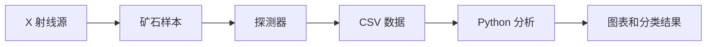

# 组员从零入门指南

这份指南写给完全没有参与过项目的组员。你不需要一开始就懂 Geant4、XRT、C++ 或机器学习。先按顺序读完这份文档，再去看代码和论文，会轻松很多。

## 1. 这个项目到底在做什么

矿石分选的一个常见思路是：不同矿物对 X 射线的吸收能力不同。如果一束 X 射线穿过矿石，探测器接收到的信号会变化。我们可以利用这种变化判断样本更像低吸收材料还是高吸收材料。

这个项目做的事情，是用 Geant4 在电脑里搭一个虚拟实验台：



换句话说，我们先让电脑模拟 X 射线穿过矿石，再把探测器数据导出来，最后用 Python 做统计和基础分类。

## 2. 这个项目由哪些环节组成

这个项目不是只拿一个现成 CSV 表格训练模型，而是把数据产生、数据整理和结果表达放在同一个链路里：

- 用 C++ 和 Geant4 搭建仿真场景。
- 用材料配置表描述矿物。
- 用能谱文件描述 X 射线源。
- 输出事件级数据和探测器响应。
- 再用 Python 把物理信号变成可解释特征。
- 最后形成结果图、结果表和论文式说明。

所以读这个项目时，不要只看最后的分类结果，也要看前面的仿真建模、事件输出和特征整理。

## 3. 先理解几个核心词

**Geant4** 是一个粒子物理仿真工具包。这里用它来模拟 X 射线穿过材料。

**XRT** 是 X-ray Transmission 的缩写，意思是 X 射线透射。它关注 X 射线穿过物体后剩下多少信号。

**矿物分选** 是把不同性质的矿物分开。这个项目只做仿真和基础验证，不直接控制现实设备。

**探测器** 是仿真里的接收面。X 射线穿过矿石后，探测器记录能量沉积和命中信息。

**CSV** 是表格数据文件。C++ 仿真把结果写成 CSV，Python 再读取这些 CSV。

完整术语表见 `docs/GLOSSARY_BY_FIRST_APPEARANCE.md`。

## 4. 项目文件怎么读

建议按这个顺序读。第一步只需要快速扫一遍 README，不需要立刻看懂所有细节：

1. `README.md`：看项目亮点和整体结构。
2. `docs/TEAM_GUIDE_zh.md`：也就是本文，建立直觉。
3. `docs/GLOSSARY_BY_FIRST_APPEARANCE.md`：遇到术语就查。
4. `docs/FILE_MAP_zh.md`：知道每个目录干什么。
5. `docs/RUN_LOCALLY_zh.md`：尝试在自己电脑上运行。
6. `paper/main_thesis_HIT_revised_zh.md`：看正式论文式表达。

如果你只想快速看成果，先看图：

- `figures/elementary_system_flow.png`
- `figures/elementary_xray_spectrum.png`
- `figures/elementary_direct_scatter_ratio.png`
- `figures/elementary_absorption_accuracy.png`

## 5. 代码主线是什么

项目有两条主线：C++ 仿真和 Python 分析。

C++ 主线：

```text
exampleB1.cc
include/
src/
source_models/
```

它负责搭建 X 射线源、矿石、探测器和运行逻辑。

Python 主线：

```text
analysis/classify_absorption_groups.py
results/
figures/
```

它负责读取仿真输出，构造样本，训练基础分类方法，并输出结果表。

## 6. 结果怎么看

最关键结果是 `results/absorption_group_classification_summary.csv`。

这个表比较了几种基础方法，包括阈值法和 Logistic Regression。当前粗粒度吸收组分类的最高 accuracy 是 `0.98`。

要注意：这个数字只说明当前仿真设置下的粗粒度分类效果好。它不是现实设备指标，也不是所有矿物都能准确区分的证明。

## 7. 每个组员能做什么

如果你负责讲解：

- 读 `README.md` 和本文。
- 用四张核心图讲清楚流程。
- 强调“仿真系统 + 基础分类验证”的边界。

如果你负责运行：

- 读 `docs/RUN_LOCALLY_zh.md`。
- 先确认 Geant4 和 Python 环境。
- 能跑通 CMake 和 `analysis/classify_absorption_groups.py`。

如果你负责论文：

- 读 `paper/main_thesis_HIT_revised_zh.md`。
- 对照 `figures/` 和 `results/` 检查证据。
- 不要把仿真结果写成现实设备结果。

如果你负责继续开发：

- 先看 `docs/FILE_MAP_zh.md`。
- 小改动走 Git 分支和 Pull Request。
- 不要直接把主分支改乱。

## 8. 项目最容易被误解的地方

第一，Geant4 不是模型训练框架。它负责物理仿真。

第二，Python 分类不是项目的全部。分类只是把仿真数据转化为可展示结果的一步。

第三，`0.98` 不是万能成绩。它只属于当前数据、当前分类目标和当前仿真设置。

第四，公开仓库不是开源授权。组员可以学习、运行、审阅，但不能把项目改名后当成自己的独立成果发布。

## 9. 一句话复述

这个项目用 Geant4 做 XRT 矿物分选仿真，用 Python 分析探测器数据，并完成了本科级别的代码、图表、结果和论文材料闭环。
