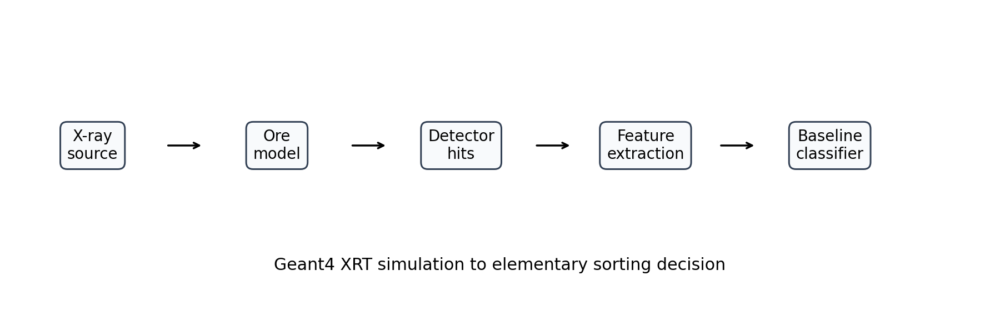
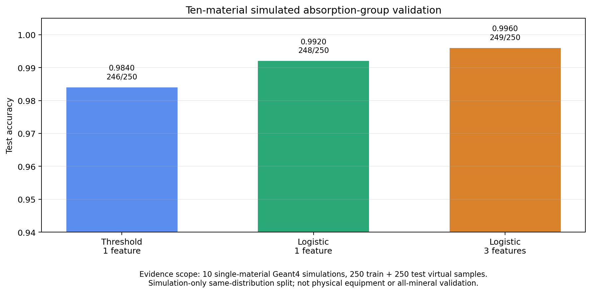

# 基于 Geant4 的 X 射线透射矿物分选仿真系统设计、数据链路与本科级验证

## 摘要

X 射线透射分选利用不同材料对 X 射线的衰减差异来辅助矿物预选和物料识别。真实 XRT 设备涉及射线源、探测器、屏蔽结构、样品输送、安全规范和现场标定，直接取得系统性真实数据对本科项目并不现实。因此，本项目选择先完成一个可运行、可复查、可扩展的仿真与分析闭环：使用 Geant4 搭建 X 射线源、矿物样本和探测器模型，生成事件级 CSV 和命中级 CSV；再使用 Python 对事件数据进行质量检查、样本聚合、特征提取、训练/测试拆分和基础分类验证。公开证据包包含 Quartz、Calcite、Orthoclase、Albite、Dolomite、Pyrite、Hematite、Magnetite、Chalcopyrite 和 Galena 十种单一材料，每种材料运行 5000 个仿真事件，每 100 个事件聚合为 1 个虚拟样本，共得到 500 个虚拟样本。按照每种材料前 25 个样本训练、后 25 个样本测试的规则，训练集和测试集各包含 250 个样本。结果显示，基于主 gamma 透射率的阈值法在测试集上达到 0.9840 accuracy，单特征 `StandardScaler + LogisticRegression` 达到 0.9920，三特征 Logistic Regression 达到 0.9960。该结果说明，在当前固定几何、单一材料和仿真条件下，XRT 事件数据能够形成可解释的低/高吸收组区分特征。本文结论仅限于本科级仿真链路和粗粒度吸收组分类验证，不代表真实设备性能、复杂矿流泛化能力、工业部署能力或对所有矿物的普适识别能力。

**关键词**：Geant4；X 射线透射；矿物分选；仿真；特征工程；Logistic Regression；本科项目

## 1. 引言

矿物分选的工程目标是在破碎、磨矿或进一步加工之前，尽可能识别有价值物料和低价值物料，从而降低后续处理成本并提高资源利用效率。传统分选方法常依赖密度、磁性、颜色、粒度或人工经验，但复杂矿石中常出现外观相近而内部组成不同的情况，仅凭表面信息并不充分。X 射线透射技术关注 X 射线穿过样本后的强度和能量响应。当材料密度、有效原子序数和厚度不同时，透射信号会发生不同程度衰减，因此 XRT 被广泛视为传感器分选中的重要方向之一。

本项目的实际起点不是直接做工业设备，而是完成一个本科阶段能够严格交付的研究训练任务。真实 XRT 系统需要稳定射线源、探测器、样品输送系统、辐射安全条件和真实矿样标注；真实矿石数据还受到含水率、裂隙、孔隙、粒径、混合矿物、仪器漂移和现场工况影响。如果在证据不足时直接宣称真实设备效果或产品覆盖能力，结论会越界。更合理的路径是先在可控仿真条件下验证物理信号链路和数据分析链路是否成立，再把后续真实设备、混合矿样和产品化问题作为下一阶段研究。

因此，本文的研究问题被限定为三个可回答的问题。第一，能否使用 Geant4 搭建包含 X 射线源、矿物样本、探测器和事件输出的 XRT 仿真系统。第二，仿真输出能否转化为有物理意义的样本级特征，例如主 gamma 透射率、探测器能量沉积和 gamma 命中率。第三，在明确训练/测试拆分的前提下，这些特征能否支持低吸收组与高吸收组的粗粒度分类验证。这三个问题共同构成了本项目的核心闭环：从物理仿真到数据表，从数据表到特征，从特征到可复查的分类结果。

## 2. 研究需求与项目定位

按照研究软件论文常见写法，一个项目首先要说明它解决了什么研究需求，而不是只罗列代码文件。本项目的需求是为本科项目组提供一个可学习、可运行、可复查的 XRT 仿真与分析样例。它既不是商业 XRT 分选设备，也不是覆盖所有矿物的通用识别系统，而是一个把 Geant4、CSV 数据、Python 特征工程和基础机器学习验证连接起来的教学型工程研究包。

这一定位决定了项目的设计取舍。系统优先选择清晰的材料配置、固定几何、可解释特征和基础分类器，而不是一开始使用复杂模型追求更高表面分数。阈值法和 Logistic Regression 的优势在于结果容易解释：如果高吸收材料透射率更低，低吸收材料透射率更高，那么模型表现应当能够回到物理直觉。对于本科答辩和组内交接来说，可解释性、可复现性和证据边界比复杂模型名称更重要。

本项目当前验证十种材料，是为了让公开证据包覆盖更多低吸收和高吸收示例，并展示材料目录驱动的扩展路径。材料数量本身不是项目主线，也不能被解释为产品覆盖率。只要研究目标是验证“仿真-数据-特征-分类-证据包”这一闭环，当前证据已经能够支撑本科级结论；如果后续导师要求真实设备、混合矿物或更多材料，那属于下一阶段实验设计，而不是当前结论的失败。

## 3. 相关技术基础

Geant4 是用于粒子与物质相互作用模拟的工具包，常用于高能物理、医学物理、空间辐射和探测器建模等领域。它适合本项目，是因为 X 射线本质上是光子，穿过材料时会涉及光电效应、康普顿散射和瑞利散射等电磁过程。Geant4 能够按事件追踪粒子过程，并输出命中、能量沉积、几何位置和粒子身份等信息，使 X 射线穿过矿物样本后的探测器响应可以被记录为可分析数据。

XRT 分选相关研究通常包含两个层面。第一是物理信号层面，即材料组成、密度、厚度和有效原子序数如何影响透射响应。第二是决策层面，即如何把探测器信号转化为分类或分选判断。工业系统还必须考虑输送速度、颗粒姿态、探测器阵列、喷吹执行机构、设备标定和现场维护。本科项目目前只覆盖前两个简化层面：先通过 Geant4 生成透射相关信号，再用基础算法验证这些信号是否具有分类区分度。

机器学习部分采用阈值法和 Logistic Regression。阈值法是最简单、最可解释的 baseline，用于检验单一透射率特征是否已经能区分两类材料。Logistic Regression 是经典线性分类方法，适合二分类任务；在 scikit-learn 中，`StandardScaler` 先对特征标准化，`LogisticRegression` 再学习从特征到类别的线性判别关系。本项目没有使用决策树、随机森林或深度学习，因为当前问题重点不是模型复杂度，而是数据链路、特征含义和证据边界是否清楚。

## 4. 系统设计

本项目系统由四个部分组成：Geant4 C++ 仿真、配置输入、Python 分析和结果文档。C++ 部分负责生成物理事件，配置文件负责控制材料、源项、几何和输出前缀，Python 部分负责把事件数据转化为样本和分类结果，文档部分负责把代码、数据、结果和结论组织成可复查的项目交付。

程序入口为 `exampleB1.cc`，核心类位于 `include/` 和 `src/`。`DetectorConstruction` 负责世界体、矿物样本和探测器几何；`PrimaryGeneratorAction` 按配置文件生成 gamma 源项；`SteppingAction` 在粒子步进过程中识别进入探测器的 gamma 命中并记录能量、位置、偏转角和 primary 标记；`EventAction` 在每个事件结束时汇总探测器响应；`RunAction` 在 run 开始和结束时管理 CSV 文件、累计量和 metadata 输出。这种组织方式接近 Geant4 用户应用的常见结构，也便于组员按“源项-几何-事件-命中-输出”逐层定位问题。

源项使用 `source_models/spectra/w_target_120kV_1mmAl.csv` 中的 W 靶 120 kV 能谱。程序读取能谱文件后构造累计分布，并在每个事件中按权重采样 photon energy。相比固定单能 gamma，这种宽能谱设置更接近 XRT 背景，但仍属于简化仿真，不包含真实设备中的全部源结构、滤波、探测器响应和机械系统。

样本几何采用单一材料 slab，公开验证配置中样本厚度为 10 mm，探测器位于样本后方。材料目录定义了十种材料及其化学式、密度、类别、吸收组标签、配置文件和事件文件。低吸收组包括 Quartz、Calcite、Orthoclase、Albite 和 Dolomite，高吸收组包括 Pyrite、Hematite、Magnetite、Chalcopyrite 和 Galena。这里的标签不是细粒度矿物种类识别，而是本科阶段的粗粒度吸收组任务。

| 参数 | 当前设置 | 证据位置 |
| --- | --- | --- |
| 材料数量 | 10 种单一材料 | `source_models/materials/material_catalog.csv` |
| 样本几何 | 10 mm single-material slab | `source_models/config/undergrad_batch/*.txt` |
| X 射线源 | W 靶 120 kV 能谱 | `source_models/spectra/w_target_120kV_1mmAl.csv` |
| 每材料事件数 | 5000 | `analysis/configs/run_research.mac` |
| 每虚拟样本事件数 | 100 | `analysis/classify_absorption_groups.py` |
| 每材料训练/测试样本 | 25 / 25 | `results/undergrad_validation/validation_manifest.json` |

## 5. 数据采集、质量控制与字段定义

每次 Geant4 run 会生成事件级 CSV、命中级 CSV 和 metadata。事件级 CSV 是当前分类验证的主要输入，每一行对应一个仿真事件。核心字段包括 `event_id`、`detector_edep_keV`、`detector_gamma_entries` 和 `primary_gamma_entries`。其中，`event_id` 表示事件编号；`detector_edep_keV` 表示该事件中探测器沉积能量；`detector_gamma_entries` 表示 gamma 进入探测器的次数；`primary_gamma_entries` 表示 primary gamma 到达探测器的次数。

命中级 CSV 记录更细的探测器命中信息，包括命中位置、photon energy、是否为 primary、偏转角，以及近似直接透射和散射后透射标记。当前直接/散射判据是工程近似：primary gamma 到达探测器时，若相对束流方向偏转角小于 1 度，则记为 direct primary，否则记为 scattered primary。该字段有助于理解信号来源，但不能被解释为完整散射物理过程的严格真值标注。

Python 分析脚本首先读取材料目录，确认所有启用材料都有对应配置文件和事件文件。随后脚本读取 `build/` 下的事件 CSV，将事件按 `event_id` 排序并检查事件数量、唯一事件数、重复事件数、事件编号范围和是否连续。每种材料的 5000 个事件刚好形成 50 个完整虚拟样本；若事件数不能被 100 整除，脚本会丢弃尾部不完整事件并在摘要中记录。当前证据包中所有材料均为 5000 个事件、0 个尾部丢弃事件。

| 样本级变量 | 来源字段 | 计算方式 | 含义 |
| --- | --- | --- | --- |
| `sample_id` | `event_id` | `event_id // 100` | 每 100 个事件形成一个虚拟样本 |
| `mean_detector_edep_keV` | `detector_edep_keV` | 100 个事件能量沉积均值 | 平均探测器能量响应 |
| `detector_gamma_rate` | `detector_gamma_entries` | gamma 命中总数 / 100 | 探测器 gamma 命中率 |
| `primary_transmission_rate` | `primary_gamma_entries` | primary gamma 命中总数 / 100 | 主 gamma 透射率 |
| `group_label` | 材料目录 | 材料名到吸收组映射 | 低吸收组或高吸收组 |

## 6. 特征工程、训练/测试拆分与模型

本项目中“机器学习样本”不是单个 photon event，而是由 100 个连续仿真事件聚合成的虚拟样本。这样做可以减少单事件随机波动，并把事件级探测响应转化为更稳定的样本级统计量。每种材料有 5000 个事件，因此形成 50 个虚拟样本；十种材料合计 500 个虚拟样本。

训练/测试拆分按材料分别进行：每种材料前 25 个虚拟样本进入训练集，后 25 个虚拟样本进入测试集。因此训练集包含 250 个样本，测试集包含 250 个样本；低吸收组和高吸收组在训练集、测试集中各占 125 个样本。这说明结果不是训练集准确率，但仍要注意它是同一类仿真配置下的切分测试，不等于真实设备外部验证。

脚本比较三种基础方法。第一种是阈值法 `A_threshold_transmission_only`，只使用 `primary_transmission_rate`。脚本先在训练集中分别计算低吸收组和高吸收组的平均透射率，再取两者中点作为阈值；测试样本透射率高于阈值则判为低吸收组，低于阈值则判为高吸收组。第二种是单特征 Logistic Regression `B_logistic_transmission_only`，仍只使用 `primary_transmission_rate`，但通过 `StandardScaler + LogisticRegression` 学习线性分类边界。第三种是三特征 Logistic Regression `C_logistic_transmission_edep_gamma`，使用 `primary_transmission_rate`、`mean_detector_edep_keV` 和 `detector_gamma_rate` 三个特征。

评价指标采用 accuracy 和 confusion matrix。Accuracy 表示测试样本中预测正确的比例；confusion matrix 用于显示低吸收组和高吸收组分别被预测到哪个类别。本文所有 accuracy 均来自测试集，不使用训练集结果作为性能结论。

## 7. 结果

事件行数检查显示，十种材料均生成 5000 个事件，`event_id` 范围为 0 到 4999，未出现重复事件编号；每种材料均形成 50 个完整虚拟样本。按分组统计，低吸收组和高吸收组各有 250 个虚拟样本，训练集和测试集各有 250 个虚拟样本。

| 方法 | 特征数 | 测试样本数 | 正确样本数 | 测试 accuracy |
| --- | ---: | ---: | ---: | ---: |
| 阈值法 | 1 | 250 | 246 | 0.9840 |
| 单特征 Logistic Regression | 1 | 250 | 248 | 0.9920 |
| 三特征 Logistic Regression | 3 | 250 | 249 | 0.9960 |

三种方法都表现出较高测试集 accuracy。阈值法达到 0.9840，说明单独使用主 gamma 透射率已经可以较好地区分当前仿真配置中的低吸收组和高吸收组。单特征 Logistic Regression 正确 248 个测试样本，三特征 Logistic Regression 正确 249 个测试样本，说明加入探测器能量沉积和 gamma 命中率后，在当前证据集中提供了轻微增益。

三特征 Logistic Regression 的混淆矩阵显示，低吸收组 125 个测试样本中 124 个预测为低吸收组，1 个预测为高吸收组；高吸收组 125 个测试样本全部预测正确。这个结果符合 XRT 任务的基本直觉：高吸收材料整体透射率较低，低吸收材料整体透射率较高，但低吸收材料内部可能因随机事件波动出现局部较低透射率，从而产生少量误判。

特征分布也支持上述解释。在训练集中，低吸收组 `primary_transmission_rate` 均值为 0.31656，高吸收组为 0.03248；在测试集中，低吸收组均值为 0.31256，高吸收组为 0.03248。逐材料统计显示，Galena 的主 gamma 透射率在当前配置下为 0，而 Quartz、Albite 等低吸收材料保持较高透射率。换言之，分类器不是凭文件名或索引分类，而是利用了仿真事件形成的透射响应差异。

## 8. 讨论与证据边界

本项目的主要贡献不是某一个 accuracy 数字，而是建立了一个可运行、可复查、可讲解的本科级 XRT 仿真项目链路。与只提交静态报告相比，当前仓库包含 C++ 仿真源码、材料和源项配置、Python 分析脚本、验证证据包、图表、复现说明和论文式文本。导师或组员可以沿着配置文件、事件 CSV、虚拟样本、训练/测试拆分和混淆矩阵逐层复查结论来源。

当前结果较高，主要原因是任务被限定为粗粒度吸收组二分类，并且样本为固定厚度的单一材料 slab。对于低吸收硅酸盐、碳酸盐和高吸收铁氧化物、硫化物之间的区分，主 gamma 透射率本身就具有较强解释力。因此，0.9960 是合理的测试集结果，但它不能被扩大解释为复杂矿流中的细粒度矿物识别能力。

本项目存在明确限制。第一，数据来自 Geant4 仿真，不是真实 XRT 设备采集数据。第二，训练集和测试集来自同一类仿真配置，只能说明同分布仿真切分下的表现，不能说明跨设备、跨厚度、跨粒径、跨矿区或跨随机种子的泛化能力。第三，样本为单一材料 slab，没有覆盖真实矿石中的混合、包裹、裂隙、孔隙、表面污染和颗粒姿态变化。第四，当前模型只做低吸收组/高吸收组二分类，没有做矿物种类级分类。第五，Geant4 仿真具有随机性；如果不固定随机种子，重新生成事件 CSV 时 accuracy 可能有小幅波动。

这些限制不否定项目价值，反而界定了项目的真实完成度。对本科项目来说，合理目标是完成系统搭建、数据链路、特征解释和基础验证，而不是宣称已经达到工程部署条件。如果导师后续认为当前范围不足，可以继续追加不同厚度、粒径变化、混合材料、独立重复仿真、固定随机种子策略、按 run 拆分的独立测试，或最终接入真实设备数据。另一个值得保留的后续方向，是把模型从“直接输出材料标签或分选动作”转向“输出可解释的物理/化学特征，再结合矿物字典做候选检索和人工复核辅助”；该方向目前只是研究设想，不能写成本科阶段已完成能力。

为检验上述边界，项目补充实现了材料级分选诊断线。该诊断增加了 `random_seed` 配置、pilot/full 矩阵生成、批量运行脚本、十材料标签预测、top-3 候选、置信度/间隔复核门控和 leave-one-material-out 开放集检查。在旧的 10 mm、120 kV spectrum 公开数据上，主方法 `Calibrated Extra Trees` 的十材料 top-1 accuracy 为 0.464，top-3 accuracy 为 0.876，macro-F1 为 0.4486，最小类别召回为 0.08，review rate 为 0.848，所有预设验收条件均未通过。该结果进一步证明，当前高 accuracy 只属于低/高吸收组二分类，而不能扩展解释为矿物种类级识别。材料级分选需要完整多厚度、多源项、多 seed 矩阵和更严格的 run-level 或 seed-level holdout 后再重新评价。

## 9. 复现与数据可用性

公开仓库提供复现实验所需的代码、配置和结果证据。具备 Geant4、CMake、C++17 编译器、Python、pandas 和 scikit-learn 环境后，可按照 `docs/RUN_LOCALLY_zh.md` 和 `paper/reproducibility.md` 中的命令重新运行十种材料配置。运行后，`analysis/classify_absorption_groups.py` 会读取 `build/` 下的十个 `*_events.csv` 文件，并在 `results/undergrad_validation/` 下生成验证证据包。

当前提交的证据包包括事件行数摘要、虚拟样本表、训练/测试拆分表、特征统计、分类汇总、混淆矩阵、测试集预测表和 manifest。为避免提交本机绝对路径和大型临时文件，`build/` 不作为 Git 跟踪内容；公开仓库跟踪的是紧凑的验证证据和可复现脚本。

## 10. 权利声明

本公开仓库用于项目组学习、运行、审阅、答辩展示和组内协作。代码、文档、图表和项目构思均保留权利。公开可见不等于开源授权，未经项目负责人和指导教师许可，不得复制为个人项目、转发为独立成果、商用、二次发布或冒名使用。具体条款见仓库中的 `LICENSE.md` 和 `NOTICE.md`。

## 11. 结论

本文完成了一个基于 Geant4 的 XRT 矿物分选仿真系统设计与本科级验证。系统能够通过材料目录和配置文件运行十种材料的 X 射线透射仿真，输出事件级 CSV 和命中级 CSV，并由 Python 构造虚拟样本、进行质量检查、提取物理相关特征、完成明确训练/测试拆分下的粗粒度吸收组分类。当前证据包显示，三特征 Logistic Regression 在 250 个测试虚拟样本上正确 249 个，测试 accuracy 为 0.9960。该结果支持“当前仿真设置下低吸收组与高吸收组具有可区分 XRT 特征”的结论，但不支持真实设备部署、复杂矿流泛化、所有矿物覆盖或产品级自动分选等更强说法。项目的实际价值在于把仿真、数据、特征、模型、结果和文档组织成了一个可学习、可运行、可复查并可继续扩展的本科工程研究闭环。

## 参考文献

参考文献详见 `paper/references.md`。
